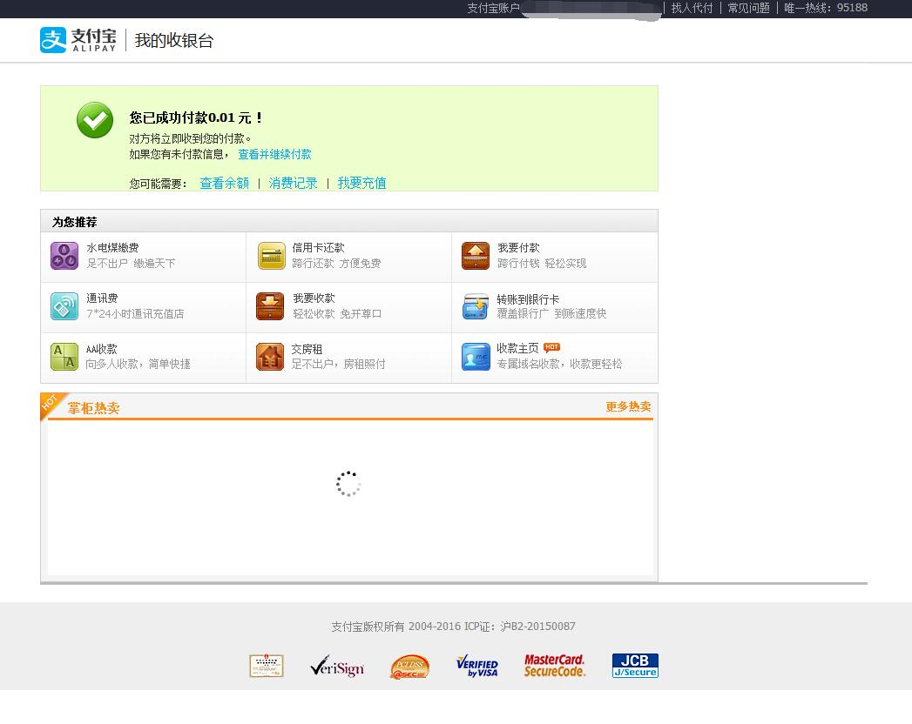
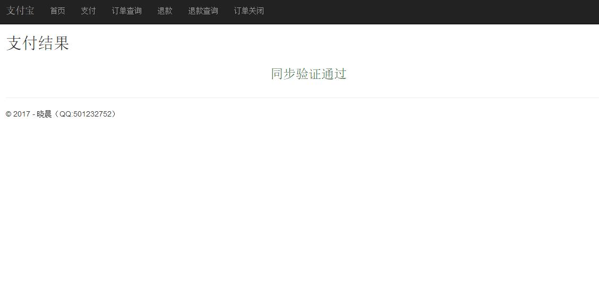
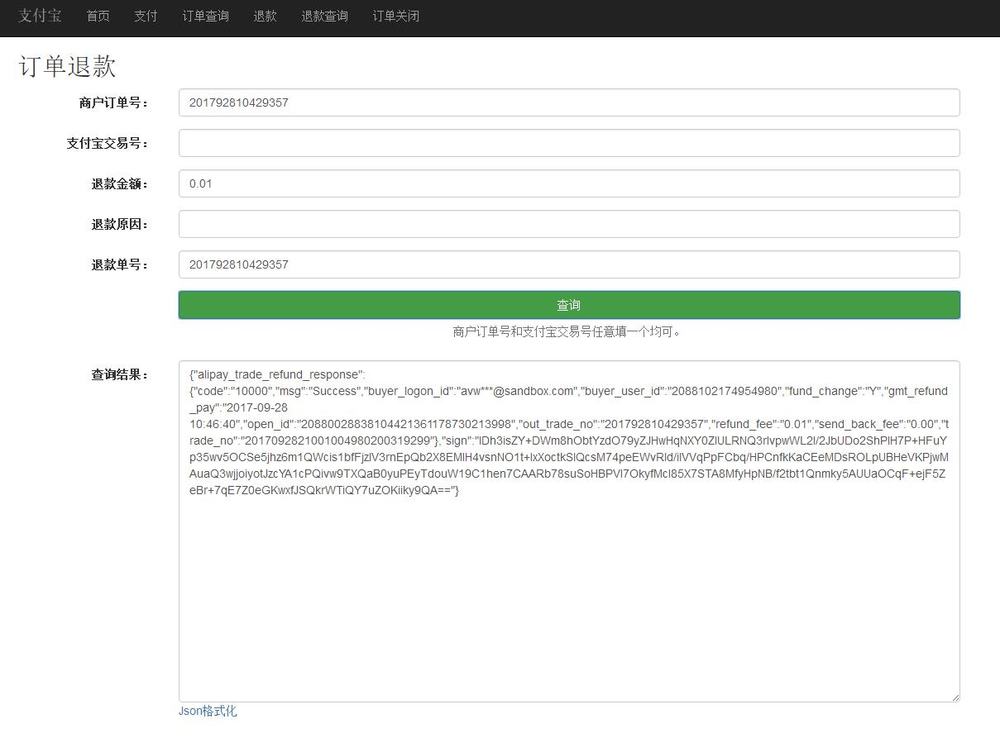
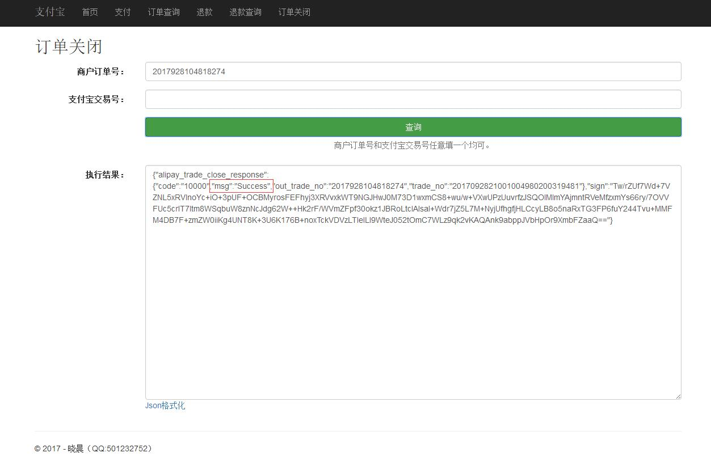

# Alipay.Demo.PCPayment
支付宝PC网站支付Demo，实现支付、支付同步回调、支付异步通知、订单查询、退款、退款查询、订单关闭功能。采用支付宝服务端SDK：[Alipay.AopSdk.Core](https://github.com/stulzq/Alipay.AopSdk.Core "Alipay.AopSdk.Core")，使用ASP.NET Core MVC 2.0。

# 说明文档

- [ASP.NET Core 2.0 使用支付宝PC网站支付](http://www.cnblogs.com/stulzq/p/7606164.html "ASP.NET Core 2.0 使用支付宝PC网站支付")

- [ASP.NET Core 2.0 支付宝当面付之扫码支付](http://www.cnblogs.com/stulzq/p/7647948.html "ASP.NET Core 2.0 支付宝当面付之扫码支付")

# 功能演示

- 2017-10-11新增扫码支付


- 支付创建


- 支付


- 输入支付密码


- 支付成功



- 支付成功同步回调



- 订单查询


- 退款



- 退款查询


- 订单关闭



异步通知已经实现了的，但是由于没有公网ip和花生壳等，没有测试，以后测试了加图

# 配置

配置都在`Config.cs`里面

```csharp
public class Config
{
	// 应用ID,您的APPID
	public static string AppId = "";

	// 支付宝网关
	public static string Gatewayurl = "https://openapi.alipaydev.com/gateway.do";

	// 商户私钥，您的原始格式RSA私钥
	public static string PrivateKey = "";

	// 支付宝公钥,查看地址：https://openhome.alipay.com/platform/keyManage.htm 对应APPID下的支付宝公钥。
	public static string AlipayPublicKey = "";

	// 签名方式
	public static string SignType = "RSA2";

	// 编码格式
	public static string CharSet = "UTF-8";
}
```

公钥、私钥直接填写**字符串**

如果支付接口没用申请下来，可以使用支付宝沙箱来测试。
